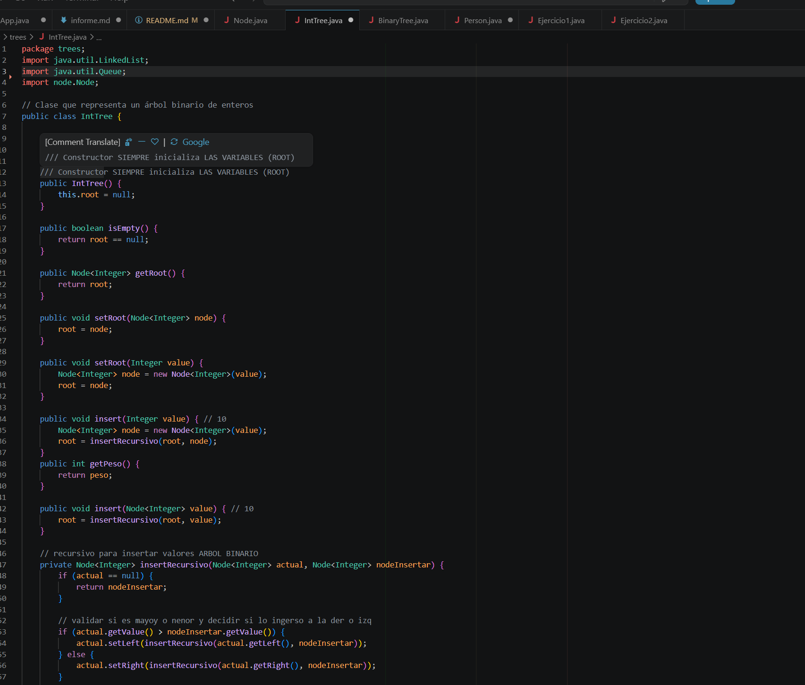
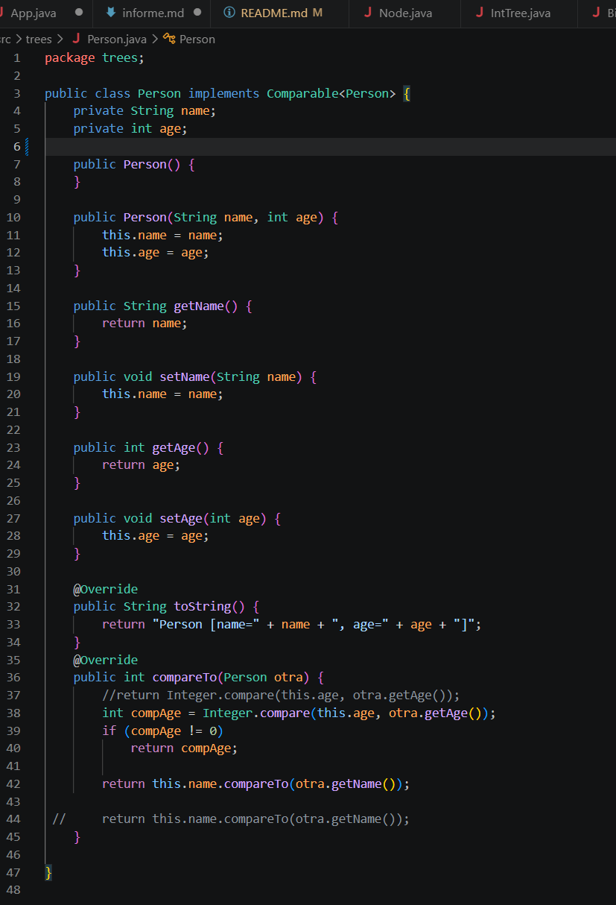
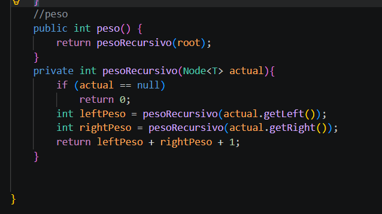

# Práctica: Árboles Binarios de Búsqueda (BST)

## Datos del Estudiante
- **Nombre:** Evelyn Mayancela
- **Curso:** Estructura de Datos
- **Fecha:** 17 de Junio del 2026

---

## 1. Implementación de Árbol Binario Genérico

**Fecha:** 17 de junio del 2026

**Descripción:**

En esta práctica se implementaron árboles binarios de búsqueda en Java utilizando clases genéricas. Se trabajó con `BinaryTree<T>` e `IntTree` para comprender las operaciones básicas de inserción y los diferentes tipos de recorrido: preOrder, posOrder, inOrder y por niveles. Además se calculó la altura y el peso del árbol de forma recursiva.

### Captura de salida en consola

### Captura de App.java

### Captura del código - BinaryTree.java

**Descripción:**
Se implementó la clase genérica `BinaryTree<T extends Comparable<T>>` que permite insertar cualquier tipo de objeto comparable. La inserción es recursiva: si el valor es menor va a la izquierda, si es mayor va a la derecha.

### Captura del código - IntTree.java

**Descripción:**
Se implementó `IntTree`, una versión específica para enteros. Incluye el método `peso()` para calcular el peso de forma recursiva y `getPeso()` que usa una variable acumulada durante la inserción.

---

## 2. Árbol Binario con Objetos - PersonTree

**Fecha:** 17 de junio del 2026

**Descripción:**
Se implementó el uso del árbol genérico con objetos de tipo `Person`. La clase `Person` implementa `Comparable<Person>` comparando primero por edad y luego por nombre alfabéticamente, lo que determina la posición de cada nodo en el árbol.

### Método compareTo implementado

### Captura de salida en consola

---
## 3. Comparativa de Rendimiento - Peso Variable vs Recursivo

**Fecha:** 17 de junio del 2026

**Descripción:**
Se realizó una comparativa de rendimiento entre dos formas de calcular el peso del árbol con 50,000 nodos aleatorios. `getPeso()` retorna una variable que se incrementa en cada inserción (O(1)), mientras que `peso()` recorre todo el árbol recursivamente (O(n)). Se midió el tiempo de cada uno con `System.nanoTime()`.

### Captura de salida en consola